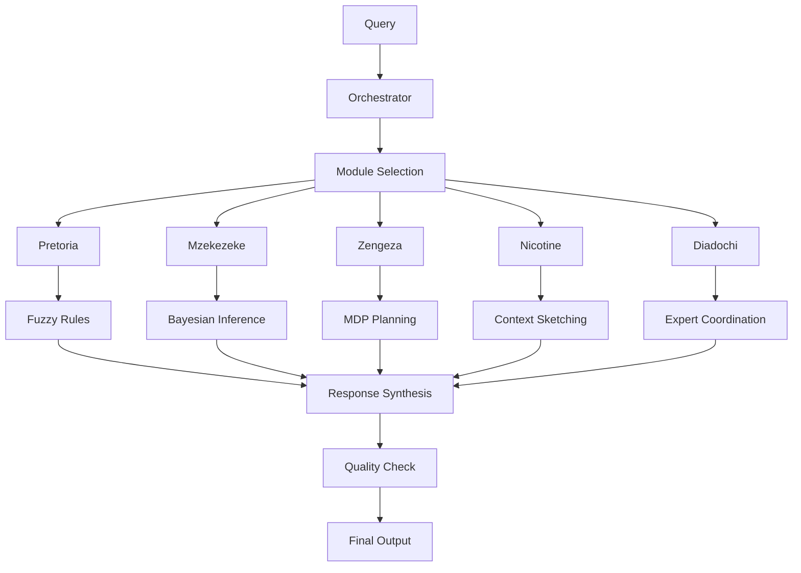

# Spectacular Cognitive Architecture Guide

## Overview

Spectacular implements a metacognitive architecture with five specialized reasoning modules coordinated by a central orchestrator. This design enables human-like reasoning for data visualization development.

## Core Components

### 1. Metacognitive Orchestrator

The central coordination system that manages module interactions and self-monitors reasoning quality.

**Key Features:**
- Cognitive state management
- Module selection and coordination  
- Quality monitoring and control
- Adaptive learning from outcomes

```python
class MetacognitiveOrchestrator:
    def __init__(self):
        self.active_modules = set()
        self.reasoning_depth = 0
        self.confidence_history = []
        
    def orchestrate(self, query):
        # Select appropriate modules
        modules = self.select_modules(query)
        
        # Coordinate execution
        results = self.coordinate_modules(modules, query)
        
        # Monitor quality
        quality = self.evaluate_quality(results)
        
        return self.synthesize_response(results, quality)
```

### 2. Pretoria: Fuzzy Logic Engine

Handles uncertainty and linguistic variables using fuzzy logic programming.

**Architecture:**
- Membership function definitions
- Rule base with 500+ fuzzy rules
- Mamdani-type inference engine
- Defuzzification using center-of-gravity

**Example Rule:**
```
IF query_complexity IS high AND domain_specificity IS moderate
THEN prompt_strategy IS multi_step AND reasoning_depth IS deep
```

### 3. Mzekezeke: Bayesian Network

Implements probabilistic reasoning through evidence integration.

**Components:**
- Evidence nodes (observable variables)
- Hypothesis nodes (inferred variables)  
- Conditional probability distributions
- Variable elimination inference
- MCMC approximate inference

**Network Update:**
```python
def update_beliefs(self, evidence):
    # Bayesian update rule
    posterior = self.prior * self.likelihood(evidence) / self.marginal
    return posterior
```

### 4. Zengeza: MDP Module

Models visualization development as a Markov Decision Process for optimal action selection.

**State Space:**
- Query understanding level
- Data analysis completeness
- Sketch quality score
- Code completeness
- Validation status

**Actions:**
- Explore query deeper
- Analyze data
- Generate/refine sketch
- Generate code
- Validate output
- Request clarification

### 5. Nicotine: Context Sketching

Maintains contextual coherence through progressive sketch refinement.

**Features:**
- Initial sketch generation
- Context tracking with semantic embeddings
- Predictive validation
- Progressive refinement

### 6. Diadochi: Model Combination

Intelligently combines multiple domain-expert models.

**Integration Patterns:**
- Router-based ensemble
- Sequential expert chaining  
- Mixture of experts
- Knowledge distillation

## Information Flow



## Inter-Module Communication

**Message Bus System:**
```python
class MessageBus:
    def publish(self, message_type, data, sender):
        for subscriber in self.subscribers[message_type]:
            subscriber.handle(data, sender)
```

**Shared Memory:**
- Context sharing between modules
- Intermediate result storage
- Access logging for debugging

## Performance Optimization

**Multi-level Caching:**
- L1: In-memory cache (fastest)
- L2: Redis cache (medium speed)
- L3: Database cache (persistent)

**Parallel Processing:**
- Module execution parallelization
- Asynchronous communication
- Resource pooling

## Quality Assurance

**Metacognitive Monitoring:**
- Reasoning coherence scoring
- Contradiction detection
- Confidence tracking
- Performance feedback loops

**Adaptive Learning:**
- Module selection policy updates
- Rule base refinement
- Network parameter optimization
- Context pattern learning

This architecture enables Spectacular to approach visualization problems with sophisticated reasoning while maintaining computational efficiency. 